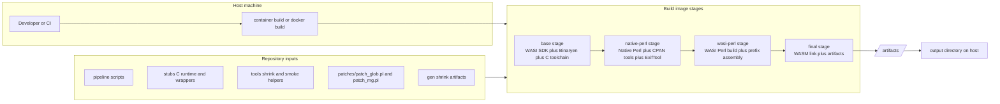
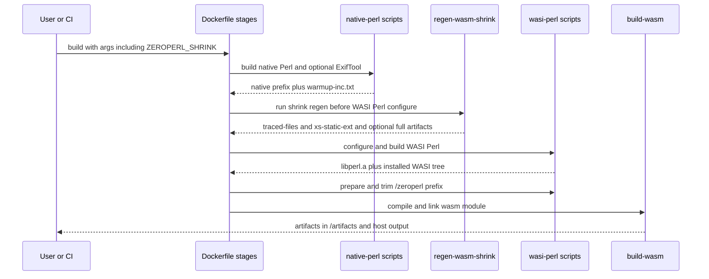
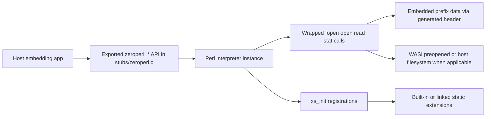
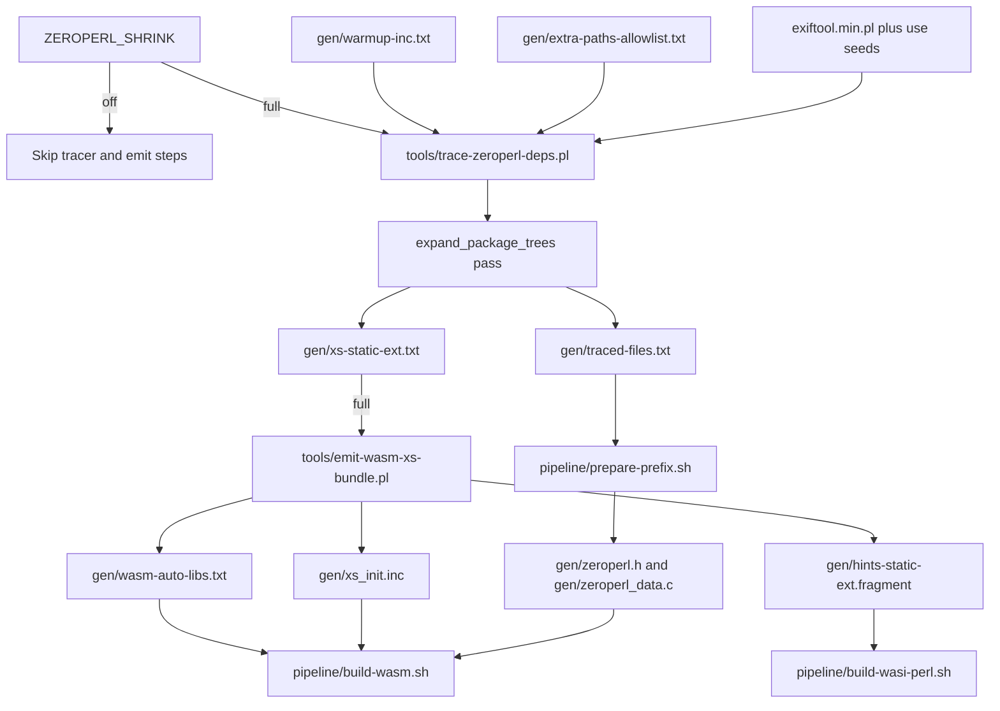
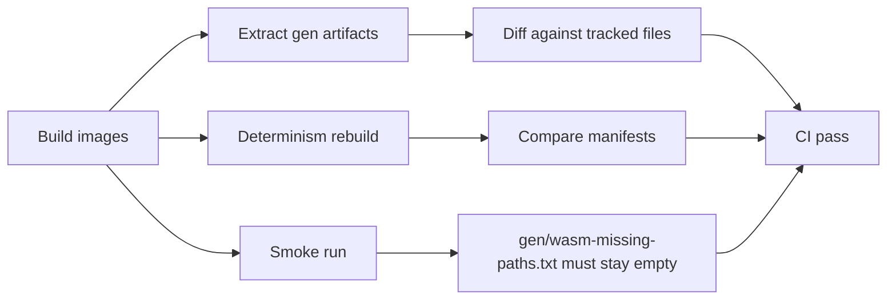

# zeroperl Architecture

This document explains how zeroperl is assembled, what runs at runtime, and how the shrink pipeline changes build inputs.

## Purpose

zeroperl packages a Perl interpreter and a curated Perl prefix into a
versioned WebDyne runtime artifact set. For example, Perl 5.44.0 build 1 is:

- `output/5.44.0/zeroperl-webdyne-5.44.0-1.wasm`
- `output/5.44.0/zeroperl-webdyne-reactor-5.44.0-1.wasm`
- `output/5.44.0/perl-wasi-prefix-5.44.0-1/`
- `output/5.44.0/config-5.44.0-1.h`
- a manifest and SHA-256 checksum list for the build

The build is orchestrated primarily by [Dockerfile](Dockerfile) and scripts in [pipeline/](pipeline).

## High-Level Component Map

## Build Pipeline

### Stage 1: base

Configured in [Dockerfile](Dockerfile).

Responsibilities:

- Install build toolchain and runtime dependencies.
- Install WASI SDK and Binaryen.
- Build static WASI copies of zlib and bzip2 via [pipeline/build-wasi-libs.sh](pipeline/build-wasi-libs.sh).

### Stage 2: native-perl

Driven by:

- [pipeline/build-native-perl.sh](pipeline/build-native-perl.sh)
- [pipeline/build-exiftool.sh](pipeline/build-exiftool.sh)

Responsibilities:

- Build native Perl and install to `/build/native/prefix`.
- Install `Module::ScanDeps` via CPAN: pinned `Module-ScanDeps-1.31` for Perl
  ≤5.18 (newer releases need `List::Util` newer than shipped in those trees),
  otherwise latest from CPAN.
- Optionally build and minify ExifTool (`exiftool.min.pl`). Minification uses the
  Debian `perltidy` package from the base image (not a CPAN `Perl::Tidy` install).
- Generate warmup include list at `gen/warmup-inc.txt`.

### Stage 3: wasi-perl

Driven by:

- [tools/regen-wasm-shrink.sh](tools/regen-wasm-shrink.sh)
- [pipeline/build-wasi-perl.sh](pipeline/build-wasi-perl.sh)
- [pipeline/prepare-prefix.sh](pipeline/prepare-prefix.sh)

Responsibilities:

- Detect Perl version (`PERL_MAJOR`/`PERL_MINOR`) and set `OLD_PERL=1` for Perl
  ≤5.18 (see `pipeline/build-wasi-perl.sh`; Perl 5.20.x is rejected outright).
- Regenerate shrink artifacts in `gen/` based on `ZEROPERL_SHRINK`.
- Apply source patches:
  - `patch_glob.pl` unconditionally — removes WASI-incompatible `getpwnam`/`getpwuid`
    from `bsd_glob.c`.
  - `patch_mg.pl` when `OLD_PERL=1` (Perl ≤5.18) — fixes missing vtable entries in
    `regen/mg_vtable.pl`.
  - `patch_sv_locale.pl` for 5.28.x only — wraps unconditional `lc_numeric_set`
    usage in `#ifdef USE_LOCALE_NUMERIC`.
- Append version-specific hint overrides when `OLD_PERL=1` (`d_setlocale`, `i_systime`,
  `static_ext`, `noextensions`, `-Wno-return-mismatch`, etc.).
- Run `Configure`, then apply post-configure source fixes when `OLD_PERL=1`: proto.h
  include guards, missing `PERL_ARGS_ASSERT` macros, `iperlsys.h` type casts.
- **`OLD_PERL` build flow (Perl ≤5.18):** pre-generate uudmap headers, build WASI `miniperl`,
  substitute native `miniperl`, stub `Errno.pm`, build with `make -k`, install with
  manual `cp -r lib` fallback if `make install` cannot run the WASM binary.
- **Default flow (Perl ≥5.22):** symlink `generate_uudmap`, `make utilities`,
  `make`, `make install`.
- Assemble `/zeroperl` prefix, prune files, optional unicore stripping, optional
  perltidy pass.
- Run in-build smoke gate after prefix assembly: when `BUILD_EXIFTOOL=true`, the last
  `RUN` in the `wasi-perl` stage executes [tools/wasm-smoke.sh](tools/wasm-smoke.sh)
  and fails the build if any missing module paths are detected.
- Emit embedded prefix header for final compile (`gen/zeroperl.h`, later compiled
  into data C source used by link stage).

### Stage 4: final

Driven by [pipeline/build-wasm.sh](pipeline/build-wasm.sh).

Responsibilities:

- Compile stubs runtime and wrapper C code.
- Compile `stubs/zeroperl.c` (with `#ifndef av_top_index` and `#ifdef PERL_SYS_FPU_INIT`
  guards for compatibility with the oldest supported `libperl.a` build, 5.18.x).
- Link reactor module with `libperl.a`, extension archives, and emulation libs.
  `-DNO_MATHOMS` is only passed for Perl 5.20+.
- Run final wasm-opt pass and write `zeroperl.wasm`.

## Build Sequence Diagram

## Runtime Architecture

Runtime logic lives mainly in [stubs/zeroperl.c](stubs/zeroperl.c).

Major runtime responsibilities:

- Export public C ABI entrypoints (for init, eval, run file, lifecycle, value conversion, and result APIs).
- Initialize and own a single Perl interpreter instance.
- Prepend embedded `/zeroperl/lib/<version>` and `/zeroperl/lib/<version>/wasm32-wasi` paths to `PERL5LIB` when they are missing, while preserving host-provided search paths.
- Provide wrapped file access so Perl can read from the embedded virtual file system prefix.
- Bridge host calls and internal error reporting.

## Portable npm Runtime and Cloudflare Distribution

The versioned npm package is self-contained at the application boundary:

- `js/zeroperl.js` is the generated browser build of the canonical
  `zeroperl-ts` bridge;
- `js/runtime/` owns the persistent interpreter, VFS construction, and
  provider-neutral WebDyne configuration;
- `js/transport/fetch-pagi.js` maps Fetch requests and PAGI HTTP/SSE events,
  with WebSocket operations supplied as an injected capability;
- `js/provider/cloudflare.js` is the default provider and is the only layer
  allowed to use Cloudflare's `WebSocketPair` and execution-context APIs;
- `js/worker.js` preserves the original Cloudflare factory export for existing
  consumers;
- `bin/` contains the Perl bootstrap and WebDyne application launcher;
- `lib/` contains the host-callback-based Pure-Perl compatibility module; and
- `scripts/` builds application VFS archives, installs optional Pure-Perl
  dependencies, generates the Cloudflare entrypoint and configuration, and
  wraps the package's pinned Wrangler version.

Tests remain in `t/` and `t.js/` and are excluded by the npm package allowlist.
Cloudflare is the supported and default provider. The boundaries permit a
future provider adapter without placing Cloudflare APIs in the runtime core;
Cloudflare-service adapters such as D1 are not core execution dependencies.

The application repository owns its PSP files and bindings. Its `app/` tree is
mounted at VFS `/app`; a `package.json` override may select another source
directory without changing that stable virtual path. The generated entrypoint
statically imports the qualified WASM from the installed package and supplies
the application and library archives to `createCloudflareWorker()`.

The virtual filesystem has four application roots alongside `/dev`:

- `/zeroperl` is the immutable library prefix embedded in the WASM module;
- `/app` is the complete application tree and WebDyne document root;
- `/perl5/bin` contains the PAGI and WebDyne launchers;
- `/perl5/lib` contains the compatibility module and optional Pure-Perl
  application dependencies; and
- `/tmp` is writable, with `TMPDIR=/tmp` preserved through WebDyne's
  request-local environment.

An optional root `cpanfile` is installed into a cached local::lib-style tree.
Only Pure-Perl output may enter `/perl5/lib`; host native artifacts and
symlinks are rejected. A release-generated hash inventory omits a dependency
only when its relative path and SHA-256 digest exactly match an embedded file.

Application VFS entries use a deterministic mtime of one whole epoch second:
the JavaScript `File` API represents this as 1000 milliseconds, avoiding
truncation to the zero mtime that WebDyne treats as a failed source stat.

### Runtime Data and Control Flow

## Shrink Modes and Artifact Flow

`ZEROPERL_SHRINK` supports two modes:

- `off`: bypass shrink regen work and keep legacy full behavior.
- `full`: enable traced site-perl copying, generated static extension hints,
  linker archive list, and generated `xs_init.inc`.

Shrink entrypoint: [tools/regen-wasm-shrink.sh](tools/regen-wasm-shrink.sh).

The tracer ([tools/trace-zeroperl-deps.pl](tools/trace-zeroperl-deps.pl)) runs in two phases:

1. **Trace phase**: hooks `@INC` while executing the entry script and seed `--use` modules to collect accessed files.
2. **Package-tree expansion phase** (`expand_package_trees`): after the trace, walks the full package directory subtrees on disk for explicit seed packages (`--explicit-package` / `TRACE_EXPLICIT_PACKAGES`) and optionally all traced dependency packages (`--expand-dependency-package-trees` / `TRACE_EXPAND_DEPENDENCY_PACKAGE_TREES`), registering every `.pm`, `.pl`, and `.al` file. This ensures lazy-loaded format handlers — for example `Image::ExifTool::XMP`, `Image::ExifTool::PNG`, `Image::ExifTool::TIFF` — are retained in the prefix even when not exercised during the warm-up trace.

Key generated artifacts:

- `gen/traced-files.txt`
- `gen/xs-static-ext.txt`
- `gen/hints-static-ext.fragment`
- `gen/wasm-auto-libs.txt`
- `gen/xs_init.inc`
- `gen/warmup-inc.txt`
- `gen/wasm-missing-paths.txt`

### Shrink Dataflow

## Verification and CI Architecture

Primary CI workflows are
[zeroperl-webdyne-release.yml](.github/workflows/zeroperl-webdyne-release.yml)
for one qualified Perl/build tuple and
[zeroperl-webdyne-npm.yml](.github/workflows/zeroperl-webdyne-npm.yml) for
packaging those exact released bytes. The npm workflow does not rebuild WASM.

Verification layers:

- Build full image and wasi-perl stage.
- **In-build smoke gate** (`wasi-perl` stage, after `prepare-prefix.sh`): when `BUILD_EXIFTOOL=true`,
  [tools/wasm-smoke.sh](tools/wasm-smoke.sh) runs inside the container and fails the build if `gen/wasm-missing-paths.txt` is non-empty.
- **Final-stage embedded smoke** (`final` stage): when `ZEROPERL_EMBED_PREFIX=true`,
  [tools/wasm-smoke.mjs](tools/wasm-smoke.mjs) runs against `/build/wasm/zeroperl.wasm` inside the image (optional `exiftool.min.pl` argument when `BUILD_EXIFTOOL=true`).
- **Embedded runtime verifier** (CI / local): `node tools/verify-embedded-inc.mjs output/5.44.0/zeroperl-webdyne-5.44.0-1.wasm` (after `npm --prefix tools ci`) uses the local `./zeroperl-ts` submodule to instantiate the built wasm directly, verifies the embedded `/zeroperl` paths are present in `@INC`, and loads WebDyne and WebDyne::PAGI without mounting the extracted prefix.
- Extract and compare tracked `gen/` artifacts from container output.
- Determinism check by rebuilding wasi-perl and comparing hash manifests. Run locally with [tools/check-wasm-shrink-determinism.sh](tools/check-wasm-shrink-determinism.sh) (requires a container environment with native prefix present).
- Run prefix smoke matrix via [tools/wasm-smoke.sh](tools/wasm-smoke.sh).
- Each release workflow invocation builds and promotes exactly one supported
  Perl version and WebDyne build number. This keeps tags, archives, attestations,
  and npm candidates independently immutable.

## SFS Compression (ZEROPERL_SFS_COMPRESS)

By default, `ZEROPERL_SFS_COMPRESS` resolves to `true` when `ZEROPERL_SHRINK=full`
and `false` otherwise (including `off`), but callers may still override it
explicitly. When `ZEROPERL_SFS_COMPRESS=true`, the embedded SFS payload uses
per-file LZ4 frame compression.

Generator behavior:

- [tools/sfs.js](tools/sfs.js) emits `codec=1` and `decompressed_size` per entry when compression is enabled.
- Each file is independently compressed as an LZ4 frame so random access remains entry-local.
- When compression is disabled, entries remain `codec=0` with raw byte spans.

Runtime behavior:

- [stubs/zeroperl.c](stubs/zeroperl.c) routes SFS-prefixed paths into the SFS runtime.
- [stubs/sfs_runtime.c](stubs/sfs_runtime.c) and [stubs/sfs_compression.c](stubs/sfs_compression.c) handle codec behavior per entry.
- `codec=0`: open uses raw embedded bytes.
- `codec=1`: runtime lazily decompresses with `LZ4F_*` APIs and opens the decompressed buffer.
- Decompressed buffers are cached in a global LRU:
  - Max cache entries: 4096 unique decompressed files
  - Total decompressed cache cap: 20 MB of cached data
  - Refcounted by active file descriptors to avoid evicting in-use buffers
  - If cache eviction is blocked by pinned entries, runtime degrades by serving a transient non-cached decompressed buffer for that open
  - Max concurrent SFS file opens: 16 (tracked in-memory file table)

Error policy:

- Decompression failure is fatal for that open path: return `-1` with `errno=EIO`.
- No silent fallback to compressed/raw mismatched interpretation.

Operational notes:

- The 16-file open limit tracks simultaneous SFS file opens; typical Perl/ExifTool usage stays well under this threshold.
- When a new file needs decompression and all cache spots are taken by pinned (in-use) files, the runtime allocates a temporary decompressed buffer instead of failing, ensuring forward progress at the cost of short-lived non-cached copies.
- The 20 MB cache cap is soft: it triggers eviction when exceeded, but large single files may temporarily exceed the cap while cached; the cap reconverges as files close and are evicted.

Build wiring:

- [pipeline/prepare-prefix.sh](pipeline/prepare-prefix.sh): passes `--compress` to sfs.js when `ZEROPERL_SFS_COMPRESS=true`.
- [pipeline/build-wasm.sh](pipeline/build-wasm.sh): builds SFS runtime/compression modules and links `-llz4`.
- [Dockerfile](Dockerfile) and [build.sh](build.sh): propagate `ZEROPERL_SFS_COMPRESS` build arg into image builds.

Operational rollback:

- Set `ZEROPERL_SFS_COMPRESS=false` and rebuild to return to raw embedded SFS behavior.

## Optional Embedded Prefix (ZEROPERL_EMBED_PREFIX)

`ZEROPERL_EMBED_PREFIX` controls whether the Perl library filesystem is embedded
in the wasm binary via SFS. Default is `true` (embedded). When `false`, the wasm
ships without any embedded `.pm` files — consumers must provide the Perl library
files externally and configure `@INC` themselves.

| `ZEROPERL_EMBED_PREFIX` | SFS embedding | Consumer must provide prefix |
| ----------------------- | ------------- | ---------------------------- |
| `true` (default)        | Yes           | No                           |
| `false`                 | No (empty)    | Yes                          |

Build behavior:

- [pipeline/prepare-prefix.sh](pipeline/prepare-prefix.sh): when `false`, skips SFS embedding after prefix preparation and generates an empty SFS table (zero entries) via `sfs.js --empty`.
- [pipeline/build-wasm.sh](pipeline/build-wasm.sh): when `false`, forces `ZEROPERL_SFS_COMPRESS=false` (nothing to compress).
- The prefix directory (`perl-wasi-prefix/`) is still produced as a build artifact regardless of this setting.

Consumer requirements when `false`:

- Provide the Perl library files (from `perl-wasi-prefix/`) on a mounted filesystem.
- Set `PERL5LIB` to include the versioned lib and arch directories before calling the wasm.

Smoke testing:

- [tools/wasm-smoke.mjs](tools/wasm-smoke.mjs) runs core and core-mod smoke tests.
- When `ZEROPERL_EMBED_PREFIX=true`, it runs inside the Dockerfile build (embedded SFS provides modules).
- When `false`, it runs on the host via [build.sh](build.sh) with the prefix directory mounted into the MemoryFileSystem.
- [tests/smoke/core-smoke.pl](tests/smoke/core-smoke.pl) exercises: strict, warnings, File::Spec, Data::Dumper, Encode, Digest::MD5, List::Util, IO::File, Cwd, Fcntl, File::Glob, MIME::Base64, POSIX, and basic regex/string operations.

## Source Directory Roles

- [pipeline/](pipeline): build orchestration scripts.
- [stubs/](stubs): runtime wrapper C sources, assembly helpers, headers, and cross-compilation stubs (`Errno.pm`).
- [tools/](tools): shrink generation, smoke tooling, size reporting, utility scripts.
- [gen/](gen): generated and tracked shrink artifacts plus generated embedding inputs.
- [patches/](patches): source patches applied during WASI Perl build (`patch_glob.pl` for all versions, `patch_mg.pl` when `OLD_PERL`, `patch_sv_locale.pl` for 5.28.x).
- [tests/smoke/](tests/smoke): sample corpus for smoke coverage.
- [tests/sfs/](tests/sfs): native C unit tests for the SFS runtime and compression layer.

## Extension and Change Guidelines

When changing architecture-sensitive paths:

- Keep `regen-wasm-shrink` before `build-wasi-perl` so generated hints are available at configure time.
- Keep `prepare-prefix` before final link so embedded prefix data reflects current shrink mode.
- Preserve `off` as safe fallback mode for debugging and bisecting.
- If adding new generated shrink artifacts, wire them into CI artifact extraction and determinism checks.
